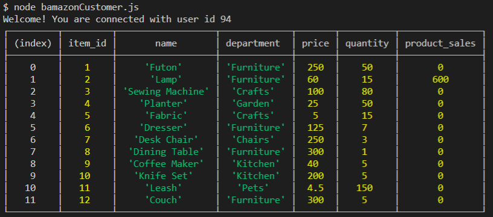
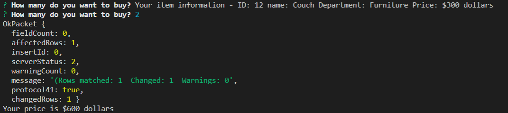
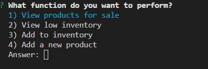
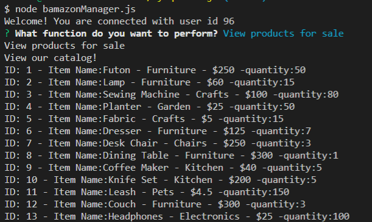
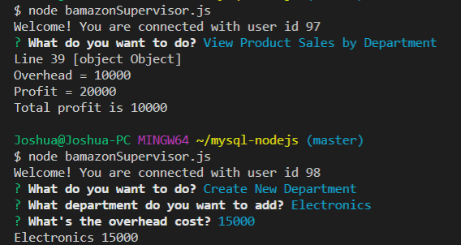

# mysql-nodejs
First, mysql and inquirer packages must be installed to run the program.

bamazonCustomer.js Guide -
To get started, open up bamazonCustomer.js in your terminal and type node bamazonCustomer.js

This will open up a list of items along with department, price, quantity and product sales.

 

After this it will prompt the user to pick an item using item_id they'd like to purchase, as well as returning information about the item.

The program will then prompt the user how many they would like to buy, if it's more then quantity available, the program will end with an error regarding not enough quantity.

Otherwise it will continue as normal, you input the quanity to purchase and it will return a confirmation and the total price and add the total price to the sales column.

bamazonManager Guide - 

To get started, open up bamazonManager.js in your terminal and type node bamazonManager.js
 

 It will return a list of prompts, view products for sale will display the items as seen in the bamazonCustomer.js.
 View Low Inventory - Will list items with a quantity less then 20.
 Add to inventory - Will add quantity to an item of the users choice.
 Add a new product - Will add a new product to the database as will be demonstrated below.

As seen above, it does in fact add to the database the new item which can then be purchased.

bamazonSupervisor Guide -

To get started, open up bamazonSupervisor.js in your terminal and type node bamazonSupervisor.js

It will return two prompts to the user, one is View Product Sales by Department, the other is Create New Department.

View product sales is currently hard-coded for this example but can easily pull from the database and calculate the true profits based on sales price in a real world example.

